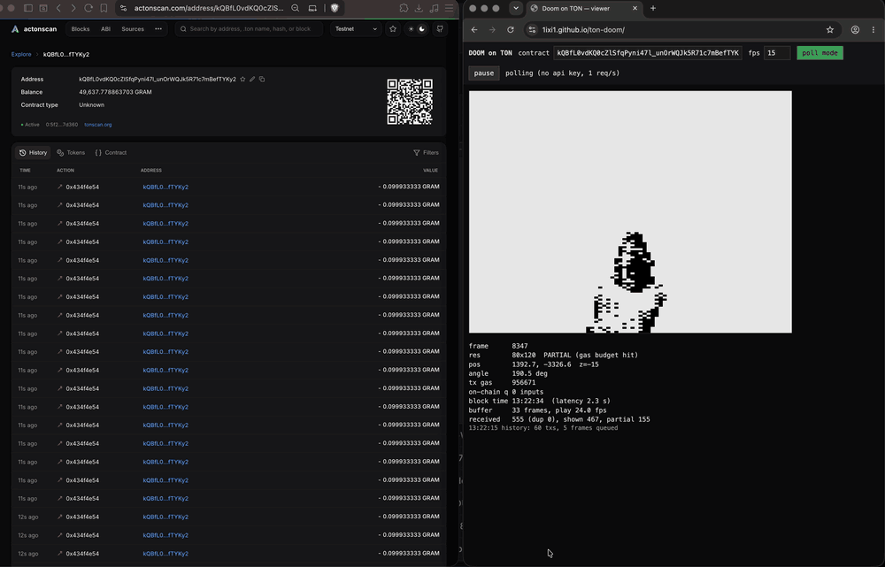

# Doom on TON



*Live playback from testnet: every frame is rendered by the smart contract in the TVM and read back
from the chain by the viewer (right); on the left, the frame transactions arriving in the explorer
([mp4](docs/demo.mp4)). Watch it live: **https://1ixi1.github.io/ton-doom/** (polls toncenter once a
second without an API key; the on-chain AI keeps walking by itself).*

Doom E1M1 rendered **inside the TVM** on TON testnet. The smart contract keeps the player state and the
level's BSP tree, receives player inputs as external messages, renders 1-bit frames on-chain and emits
each frame as an external-out message. A browser viewer subscribes to the contract on toncenter's
streaming API and plays the frames back.

Nothing is rendered off-chain: only `turn / forward / strafe` inputs go to the chain, and in the live
deployment not even those: the player is an on-chain AI.

Live contract (testnet): [`kQBfL0vdKQ0cZlSfqPyni47l_unOrWQJk5R71c7mBefTYKy2`](https://testnet.tonviewer.com/kQBfL0vdKQ0cZlSfqPyni47l_unOrWQJk5R71c7mBefTYKy2)
(also on [actonscan](https://actonscan.com/address/kQBfL0vdKQ0cZlSfqPyni47l_unOrWQJk5R71c7mBefTYKy2?network=testnet)).
Every transaction there is one rendered frame.

## How it works

```
 inputs (3 bytes/frame) ──external──▶ Doom.tolk ──┬─▶ FrameEvent (ext-out, 80x120 1-bit)  ──▶ toncenter ──▶ viewer
                                       ▲          └─▶ Continue (internal to itself, 0.1 TON)
                                       └──────────────────┘   one frame per transaction, up to ~10 per block
```

* `contracts/Doom.tolk` — the renderer (Tolk 1.4.2). Doom's algorithm: front-to-back BSP walk,
  bbox culling, solid-column mask, per-column wall/portal drawing with ceiling/floor clips packed into a
  257-bit integer per screen column, ordered dithering by distance and sector light.
  `contracts/render-asm.tolk` — the hot column loops as hand-written TVM assembly, generated and verified
  by `tools/asmgen.py` + `tools/stacksim.py`.
* External `DOOM` message: `op:32 batchId:32 count:8 (turn:int8 fwd:int8 side:int8 flags:uint8) x count`
  (flags bit 0 = fire). Batch ids are consecutive: `lastBatch + 1` is applied at once, batches that arrive
  ahead of it (same block, random order) wait in a 3-slot reorder buffer, and when the buffer is full or
  the oldest waited 2 s the batches before it are declared lost and skipped, like a game over UDP; old or
  duplicate ids are rejected before `ACCEPT` (free). Inputs are queued in the contract state; every
  transaction pops one input, moves the player (blockmap collisions, sliding along walls like Doom),
  renders and emits the frame, then sends itself a `CONT` message if the queue is not empty. Frames
  therefore continue across blocks at up to the block gas limit (~10 frames per 0.4 s block).
* **Input relays** (`contracts/Relay.tolk`): the mempool caps pending external messages per address and
  sometimes never delivers one, which made a player's input stream stall. A relay takes an external
  `dest:address` + command and forwards the command to that address as an internal message (same block,
  no extra latency); the Doom contract accepts the same commands from internal messages. The viewer sends
  batches to 50 relays in turn (`scripts/deploy-relays.tolk` deploys them with the same top address bits
  as the Doom contract, so a shard split keeps them together). Testnet toy: any destination, no signature.
* A gas guard keeps every transaction under 1M gas: when the budget (900k for rendering) is hit, the frame
  is emitted partial (`flags & 1`, far walls or sprites missing) instead of failing. Busy hangar views with
  several targets in sight are partial about a quarter of the time.
* **Wanderer AI on-chain** (`STRT` / `STOP` externals): when the input queue is empty the contract drives
  the player itself — three probes (ahead, ±45°) against a Doom-style blockmap of blocking lines, turning on
  the spot when blocked, steering away from walls while walking, a little random drift (LCG in state). The
  self-message chain then runs with no external process at all, until `STOP` or the balance drops below
  0.4 TON. `tools/ai.py` + `tools/blockmap.py` are the bit-exact reference.
* **Pistol**: the weapon sprite (PISGA0 + muzzle flash PISFA0 from the WAD, downscaled and dithered by
  `tools/sprites.py`, stored in the level cell) is composited over every frame on-chain; it bobs while
  walking and fires now and then (a two-frame flash when the state LCG hits 1/64). No ammo.
* **Targets** (`tools/monsters.py`): six imps stand in the hangar. A shot hits the nearest living one within
  20 map units of the view axis and not behind a wall; six hits kill it (pain frame, five death frames,
  the corpse stays). Sprites (TROO from the WAD, 7 frames x 9 scales, dithered with a black outline) are
  drawn *inside* the BSP walk when their subsector is visited: front to back, into the still-open rows of
  their columns, so nearer walls hide them and they hide farther walls without a depth buffer. About 6k gas
  per visible sprite plus ~0.7k per column; sprites are skipped when the gas budget runs low.
* `tools/render.py` — the reference renderer in Python, bit-exact with the contract (the tests compare
  frame hashes). `tools/golden.py` builds golden frames, `tools/level_encode.py` packs E1M1 into cells,
  `tools/wad.py` parses the WAD, `tools/boc.py` is a dependency-free BOC/cell library.
* `viewer/index.html` — the viewer (WebSocket streaming, `min_finality: confirmed`, adaptive playback).
  With a local `config.js` (API key, relay addresses) it also has a **play** mode: arrows / WASD walk and
  turn, space fires; key samples (10/s, double steps) are packed into small batches (`viewer/boc.js`
  builds the BOC in the browser) sent to the relays every 0.3 s, confirmed from the transaction stream
  and resent once with a nonce if a batch does not land. Measured: 0.8 s from key press to the frame on
  screen, no stalls over 45 s of continuous play. The "pending frames" option subscribes with
  `min_finality: pending`: toncenter emulates the transactions on receipt and the frames arrive in ~0.35 s,
  marked EMULATED (orange border) until the block confirms them; the confirmed frame is compared with the
  emulated one and corrections are counted.
* `tools/doom.py` — CLI: send inputs, run the autopilot demo feeder, dump frames as PNG.

## Running

```bash
acton build && acton test                  # emulator: golden-frame tests, gas numbers
acton script scripts/deploy.tolk --net testnet     # deploy (wallet main-w9), prints DOOM_ADDRESS
acton script scripts/topup.tolk --net testnet <addr> 50000      # top up; scripts/withdraw.tolk takes it back
DOOM_ADDRESS=<addr> RELAY_COUNT=50 RELAY_GRAMS=100 acton script scripts/deploy-relays.tolk --net testnet   # play mode relays
python3 tools/doom.py start                        # let the on-chain AI run (stop: doom.py stop)
python3 tools/doom.py demo --rate 25 --batch 29   # feed the scripted E1M1 walk (address from .env)
python3 tools/viewer_config.py && open viewer/index.html   # viewer config (address, key) from .env
```

`.env` (not committed) holds `TONCENTER_TESTNET_API_KEY=...`, `DOOM_ADDRESS=...` (printed by the deploy
script) and, for play mode, `DOOM_RELAYS=a,b,c` (printed by `scripts/deploy-relays.tolk`). Needs `assets/doom1.wad` (shareware; `python3 tools/wad.py assets/doom1.wad E1M1 --json assets/e1m1.json`,
then `python3 tools/level_encode.py assets/e1m1.json assets/e1m1-level.boc` packs the level, blockmap and sprite).

## Numbers (testnet, 80x120 shown at 4:3)

* ~700k gas per frame on average, max ~980k (guarded); ~0.05 TON per frame. Vertical resolution is free (cost is per column).
* Frames reach the viewer ~0.6 s after the block time (`confirmed` finality).
* External messages to one address are rate-limited by the mempool (~30 per 10 s), hence batches of
  20–40 inputs per external and the self-message chain for rendering.
